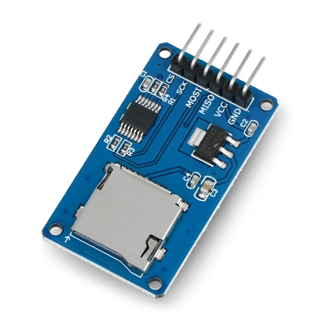
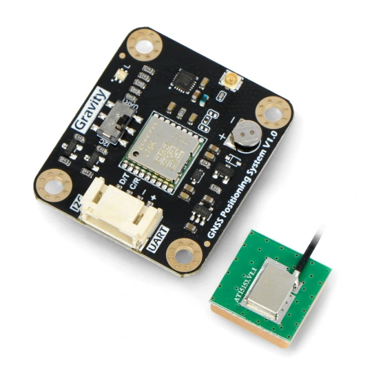
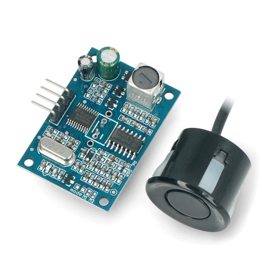

# Grant Rekora - Pomiary batymetryczne

Jest to repozytorium prezentujące realizację modelu do pomiarów batymetrycznych w ramach...

## Wykorzystane moduły:

- Moduł czytnika kart microSD ([link](https://botland.com.pl/akcesoria-do-kart-pamieci/8230-modul-czytnika-kart-microsd-5904422311278.html?cd=18298825138&ad=&kd=&gad_source=1&gclid=Cj0KCQjw4MSzBhC8ARIsAPFOuyV3e0OKvE2_MWXHbHzuE3z-97jvh5oQhjkQfZgNQd0Qb-kYaUrYY7caAhA6EALw_wcB)) 

- Moduł odbiornika GNSS GPS DFRobot TEL0157 ([link](https://botland.com.pl/moduly-gps/22671-gravity-modul-odbiornika-gnss-gps-beidou-i2cuart-dfrobot-tel0157-6959420923199.html?cd=18298825651&ad=&kd=&gad_source=1&gclid=Cj0KCQjw4MSzBhC8ARIsAPFOuyVK5DkbfYtcIf9Kkr6AhN3Mr3t-RRxih82mm45TOmbRo41qDEjdA6waAuWuEALw_wcB)) 

- Moduł ultradźwiękowego czunika odległości JSN-SR04T z sondą wodoodporną ([link](https://botland.com.pl/ultradzwiekowe-czujniki-odleglosci/7266-ultradzwiekowy-czujnik-odleglosci-jsn-sr04t-20-450cm-z-sonda-wodoodporna-5904422310066.html)) 

## Jak rozpocząć pracę:
Aby uruchomić program, należy najpierw zainstalować odpowiednie biblioteki:

- *SD* by Arduino, SparkFun v1.2.4
- *DFRobot_GNSS* by DFRobot v1.0.0
- *TODO* - by TODO (biblioteka do echosondy)

Wszystko wykonujemy w programiue Arduino IDE w zakładce "Menedżer bibliotek" wpisując powyższe nazwy i klikając "Zainstaluj".

Następnie podpinamy odpowiednio przewody modułów do PINów Arduino Uno w następującej kolejności:

TODO - tutaj dodamy tabelkę, zdjęcia, wizualizację...

W folderze *getGNSS* znajduje się kod dostosowany do uruchomienia modułu GNSS i weryfikacji poprawności połączenia. Zawiera w sobie dodatkowe komentarze z przypiskiem KJ, które tłumaczą poszczególne fragmenty kodu.

## Pierwsze Uruchomienie

TODO

## Wyniki

TODO

